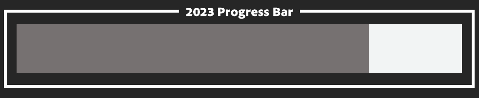
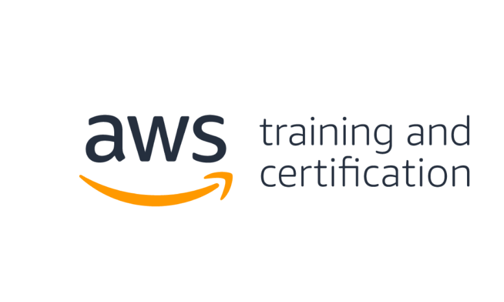
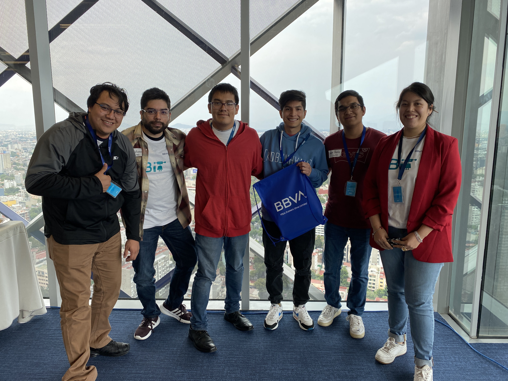

<!-- add a descriptive banner -->

    

<!-- add a myself quote -->
<h1 align='center'>
The more I train, the more
 opportunities I have✨
</h1>
<!-- Add contact stamps -->

  <samp>
    

       
        
        
      
    

        
  </samp>

<!-- My currently work stack -->

- 🌱 Currently learning **Python**: <a href="https://github.com/mouredev/Hello-Python" target="blank">Full Python</a>
- 💻 I use the **MERN programming stack** to develop front-end,  back-end and server infrastructure for web applications.

<!-- &nbsp; -->

## 🚀 &nbsp;Some of the technologies I've worked with

<h3 align='center'>
I'm always looking to expand my tech stack and learn new tools and technologies! Here are some languages and frameworks that I use regularly
</h3>
 

 
        

            
        
        
        
 
         
            <a> 
            <!-- html, css, js -->
                &nbsp;
                &nbsp;
                &nbsp;
             
            <!-- React, Node, Ts, Redux Axios -->
                &nbsp;
                &nbsp;
                &nbsp;
                &nbsp;
                &nbsp;
             
            <!-- Python, Django, Flask-->
                &nbsp;
                &nbsp;
                <!-- &nbsp; -->
             
            <!-- MySQL, PostgreSQL, MongoDB -->
                &nbsp;
                &nbsp;
                &nbsp;
                &nbsp;
             
            <!-- Git, Github, Md, Postman -->
                &nbsp;
                &nbsp;
                &nbsp;
                &nbsp;
             
            <!-- Figma, Il, Ph, In, -->
                &nbsp;
                &nbsp;
                &nbsp;
                &nbsp;
             
            <!-- Google Colab, Open AI -->
                &nbsp;
                &nbsp;
            </a> 
              
               
                
        

## 🔥 &nbsp;My Sprints

<table style="border:none!important;">
  <thead align="center">
  
  </thead>
  <tbody>
    <tr>
        <td width=50%;>
            

            <strong>Python documentation review:</strong>
            exercises and notes to review Python syntax (Basic)
            

            <a align="center" href='#-my-sprints'>
            &nbsp;
            </a>
            
        </td>
        <td width=50%;>
            
        </td>
    </tr>
    <tr>
        <td width=50%;>
            

            <strong>PostgreSQL in Django:</strong>
            Make a database change to scale and optimize the needs of applications.
            

            <a href='#-my-sprints'>
            &nbsp;
            </a>
            <a href='#-my-sprints'>
            &nbsp;
            </a>
            <a disabled href='#-my-sprints'>
            &nbsp;
            </a>
            <!--  -->
        </td>
        <td width=50%;>
            
        </td>
    </tr>
  </tbody>
</table>
<!-- 
 -->
    <!-- 
 -->
    <!--  -->
<!-- ## 👇More -->
<!-- 
 -->
<!-- <table> -->
  <!-- <thead> -->
    <!-- <tr align="center"> -->
      <!-- <th>Sprint</th> -->
      <!-- <th>Resources</th> -->
      <!-- <th>Duration</th> -->
    <!-- </tr> -->
  <!-- </thead> -->
  <!-- <tbody> -->
    <!-- <tr> -->
      <!-- <td width=50%;>
        

        <strong>PostgreSQL in Django:</strong>
        Make a database change to scale and optimize the needs of applications.
        

      </td> -->
      <!-- <td align="center" width=50%;> -->
        <!-- <a href='#-my-sprints'> -->
            <!-- <a href="https://github.com/hackaton-mayo-23/eq5" target="_blank">
            &nbsp;
            </a> -->
            <!--  -->
      <!-- </td> -->
    <!-- </tr> -->
  <!-- </tbody> -->
<!-- </table> -->
<!-- 
 -->

## 📅&nbsp;My Code Year

 

    <table border=0 width="100%">
        <tr>
            <td border=0 width=50%;>
                <h2 align="center">Amazon Web Services Cloud Foundations (Oct-Nov-Dec)</h2>
                

                    
                    

                    

                    
<strong>AWS Academy Cloud Foundations</strong> is aimed at students and professionals seeking a general understanding of cloud computing concepts. 
                    <strong>Currently enrolled in the course</strong>
                    

                
            
            </td>
            <td width=50%;>
                <h2 align="center">Symposium on the Philosophy of Computing (Dec)</h2>
                

                    
                     
                    

                    

                    
This symposium, the first of its kind in Latin America, aims to establish a necessary locus for the study of philosophical problems related to computing in all its dimensions. 
                    <strong>On-site assistance</strong>
                    

                

            </td>
        </tr>
    </table>

 

    <table>
    <tr>
        <td border=0 width="100%">
            <h2 align="center">Hackaton BBVA (May)</h2>
            

                
                 
                 
                

                    <a href="https://github.com/hackaton-mayo-23/eq5" target="_blank">
                    &nbsp;
                    </a>
                

                
Recruitment Hackathon: last test of the process (in person in CDMX) to join the technological core of BBVA Mexico in areas <strong>focused on devising, developing and promoting cutting-edge digital products and services</strong>, working with agile methodologies, making the bank more accessible to the customer. 
                <strong>#1 First place team.</strong> 
                

            
              
        </td>                                                   
    </table>            

 

    <table style='border: none;' width="100%">
        <tr>
            <td style="max-width: 50%;">
                <h2 align="center">OpenFinance UI (Jan-Feb-March)</h2>
                

                    
                     
                    

                     
                    

                    
Open Finance Platform provides a digital environment for users to interact with decision makers of the most recognized companies worldwide. 
                    <strong>Last quarter working on Frontend development, as well as database error handling and code refactoring (2022-2023).</strong>
                    

                
            
            </td>
            <td style="max-width: 50%;">
                 
                <h2 align="center">MongoDB (June)</h2>
                

                    
                     
                    

                     
                    

                    
<strong>Incorporation of the use of non-relational databases into my programming stack. </strong>Understanding data management using MongoDB requests.
                     
                     
                     
                     
                    

                

            </td>
        </tr>
    </table>

 

<!-- 
 -->

<!--
Here are some ideas to get you started:
- 🔭 I’m currently working on ...
- 🌱 I’m currently learning ...
- 👯 I’m looking to collaborate on ...
- 🤔 I’m looking for help with ...
- 💬 Ask me about ...
- 📫 How to reach me: ...
- 😄 Pronouns: ...
- ⚡ Fun fact: ...
-->

<!-- Designing tools -->
<!-- <h2>📊 Weekly development breakdown: </h2>
<table>
                <tr>
                    <td width=215px;>
                        Python
                    </td>
                    <td>
                        11 hrs 43 mins
                    </td>
                    <td>
                        ██████░░░░&nbsp;&nbsp;(20.01 %)
                    </td>
                </tr>
                <tr>
                    <td width=220px;>
                        CSS
                    </td>
                    <td width=145px;>
                        3 hrs 8 mins
                    </td>
                    <td width=230px;>
                        █░░░░░░░░░&nbsp;&nbsp;(17.92 %)
                    </td>
                </tr>
                <tr>
                    <td width=220px;>
                        HTML
                    </td>
                    <td width=145px;>
                        2 hrs 27 mins
                    </td>
                    <td width=230px;>
                        █░░░░░░░░░&nbsp;&nbsp;(14.08 %)
                    </td>
                </tr></table> -->

